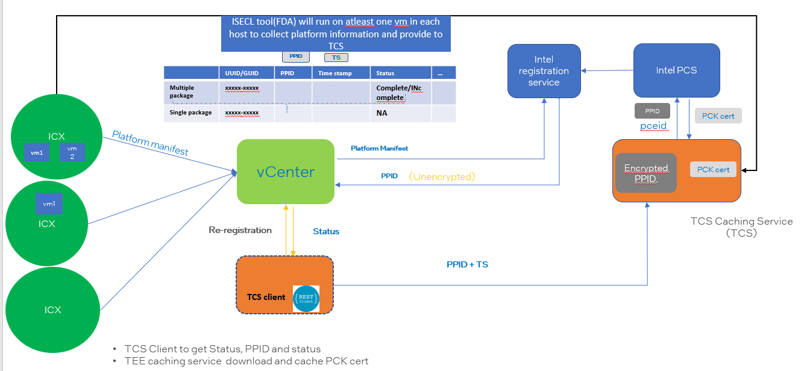
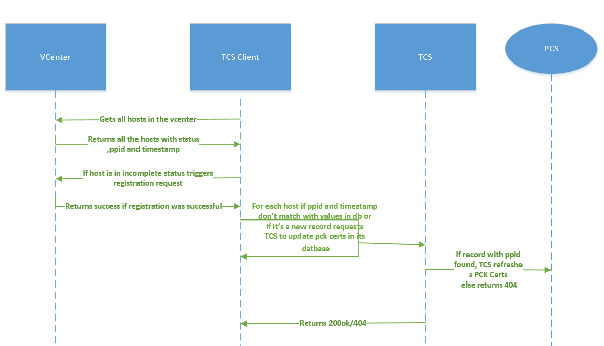
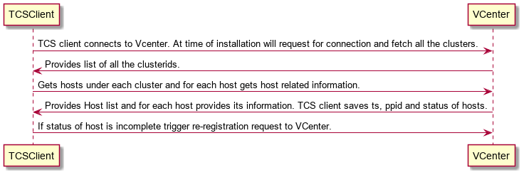
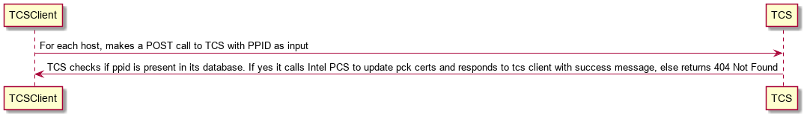

# **VMware Caching Service**

#### Related/Discussed Features
* Gather all SGX host related information from VCenter cluster
* Triggering re-registration of SGX host for TCBRecovery/New Hosts.
* Updating pck certs of a SGX host in TEE Caching Service

#### Related/Discussed Components
* TEE Caching Service(TCS)
* TEE Caching Service Client(TCS Client)
* Python Binding library for VCenter APIs
* An ISECL tool called FDA to fetch platform collaterals and push to TCS.

## Table Of Contents
* [Requirements](#requirements)
* [Architecture](#architecture)
    * [Introduction](#introduction)
    * [Design](#design)
        * [REST API Calls](#rest-api-calls)
    * [Command Line Interface](#command-line-interface)
    * [Setup](#setup)
    * [Installation](#installation)
    * [Logging](#logging)
    *  [DataBase Design](#database-design)


#### Requirements

| ID        | Description  | Priority              |
|-----------|--------------|-----------------------|
|TCSClient01| Implement API to fetch all the SGX Hosts Information             | 1         |
|TCSClient02| Trigger SGX Re-registration for tcb recovery                    | 1         |
|TCSClient03| Maintain db to store data received from VCenter                 | 1         |
|TCSClient04| Periodically trigger re-registration of SGX hosts with status set to "INCOMPLETE"| 1         |
|TCSClient05| Implement a POST API in TCS to fetch updated PCK Certs for each host         | 1         |
|TCSClient06| Make sure that FDA runs on vm spawned on ESXI host and pushes platform data             | 1         |


#### Architecture
This document defines design specifications for TCS Client and TCS, a component of ISECL.


##### Introduction
When a security vulnerability is found and it affects one of the components in the Intel® SGX TCB, an Intel® SGX TCB Recovery Event process is initiated. This could result in microcode or bios to be updated. Once tcb recovery is done the platform needs to be registered again with Intel PCS.
In case of tcb recovery VCenter applies BIOS update or SGX factory reset. It then changes hosts status to INCOMPLETE(same case holds if a new host is added to VCenter). TCS Client will identify SGX Hosts marked as INCOMPLETE and request VCENTER to perform re-registration of such hosts. Elaborate explanation is provided below:

When a host comes up in a VCenter cluster, it needs to be registered to Intel PCS. Following flow is implemented by **VMWare** for same:
* Place ESX host in maintenance mode
* Register host with Intel registration service
* Get platform PPID and Timestamp
* Remove host from maintenance mode

However in case of TCB Recovery a request needs to be sent to VCenter to do following work:
* Place ESX host in maintenance mode
* Reboot host
* Apply BIOS update or SGX factory reset
* Reboot host
* Register host with Intel registration service
* Get platform PPID and Timestamp
* Remove host from maintenance mode

In order to facilitate above mentioned steps Intel will provide:
* FDA(ISECL tool) to push platform data to TCS
* A TCS Client which will request VCenter to register its host in case of TCB recovery or if the host is not yet registered.
* TCS Client will contact TCS to download/update pck certs

##### Design flow:

##### End To End Flow Diagram



1. TCS client runs as a daemon and gets all hosts(irrespective of their status).
2. For each unregistered host triggers registration.
3. For each host if its ppid/timestamp is changed, TCS client makes a REST Call to TCS to update PCK Certs. Since initially, there is no platform data in TCS 404 is returned.
4. If return code is 404, TCS Client  don't insert corresponding record into its database
5. Once registration is successful then only a vm can be spawned on any host. On the spawned vm(at least one) FDA is installed and executed.
6. Upon execution, FDA gathers platform collateral and push them to TCS. Please note that since registration of platform has already been taken place hence when FDA pushes data no registration takes place.
7. Upon second iteration when TCS Client runs, for hosts(irrespective of status) not present in its database/newly registered it makes a REST Call to TCS and download/update PCK Certs. Since platform data is pushed by FDA as mentioned in step 6 pck certs are refreshed.

##### Detailed Design

TCS Client:
TCS Client will run as a daemon. At the time of installation it will connect to VCenter and gets all the host related information. It also runs every t th hour(configurable).
###### TCS Client-VCenter detailed flow:


For each registered host in a cluster, VCenter stores its information(PPID,timestamp, status) in its database.


On installation TCS Client will do following:
1. Gets clusters in a VCenter.
2.  For each cluster get it's hosts.
3.  For each host get its HostSgxRegistrationInfo(includes ppid, status and timestamp).
    * If the status of host is incomplete TCS Client requests VCenter to register it
    * TCS Client sends the ppid to TCS(this is for all hosts irrespective of the status).
    * TCS checks in its database for the host. If host exists then it uses host's collateral to fetch updated PCK Certs and stores them. This flow facilitates sgx-attestaion.

After t th hour TCS Client will repeat the process mentioned above (the case holds same in case of restarting the client). It will get all the hosts from vcenter. Host related information is sent to TCS. For incomplete status hosts above mentioned flow is triggered.

##### TCS Client to TCS flow:

Once host is registered successfully or a new host with status=complete and no record in db is found, TCS Client will provide PPID to TCS so that it can get updated PCK Certs.

##### REST API Calls

TCS Client -> TCS



 ````markdown
 URL: /tcs/v4/sgx/pckcert
 Method: PUT
 Headers: "Accept" : "application/json"
 URL Params: N/A
 Data Params: {ppid: <>}
 Code: 200 OK/ 404 NotFound
Content:
{
  Status: "Successful"
}
Error Response:
Code: 401 UNAUTHORIZED
````

##### TCS Design
A new PUT API in TCS to check if the host's PPID is present in its database. If yes then TCS will fetch the corresponding updated PCK Certificate from PCS and update in its database. If not it will return "Not Found"

##### Command Line Interface
The compiled TCS Client binary shall be labeled "TCSClient". Here is a full list of TCSClient CLI commands:
run
start
stop
version
help
setup
- all
- database

The CLI will support a command to run the TCS Client service. This command will be the binary called by the systemd scripts.
> run

The CLI will support the following systemd daemon functionality:

> start
> stop

Example:
> tcs-client start

The CLI will support a command to get the Version of TCS Client service. This command will print version details on console.

> tcs-client version

CLI commands for setup shall be supported and are described in the "Setup" section.

##### Setup
Name:tcs-client.env:
```go
TC_DB_HOST=<db host name>
TC_DB_NAME=<db name>
TC_DB_USER=<db user name>
TC_DB_PASSWD=<db user password>
VCENTER_IP=<VCenter IP>
VCENTER_PORT=<VCenter port>
VCENTER_ADMIN_NAME=<VCenter admin name>
VCENTER_ADMIN_PASSWORD=<VCenter password>
REGISTRATION_URL='https://<vcenter ip:port>/api/vcenter/confidential-computing/sgx/hosts?action=register&vmw-task=true'
TCS_URL=https://<tcs ip:port>/tcs/v4/sgx/pckcert
SESSION_URL=https://<vcenter ip:port>/api/session
TASK_URL=https://<vcenter ip:port>/api/cis/tasks/
TIMER_MINS=<time to restart timer in minutes>
```

##### Logging
Logs pertaining to the TCS Client daemon shall be logged in journalctl. Logs should be able to be viewed by running the command:
> journalctl -u tcsclient


#### DataBase Design
<diagram>
The client's database consists of a single table:
<table>
<thead>
<tr>
<th>Status</th>
<th>ppid</th>
<th>created_on</th>
<th>updated_on</th>
<th>registered_time</th>
</tr>
</thead>
<tbody>
</table>

> Primary Key: PPID
